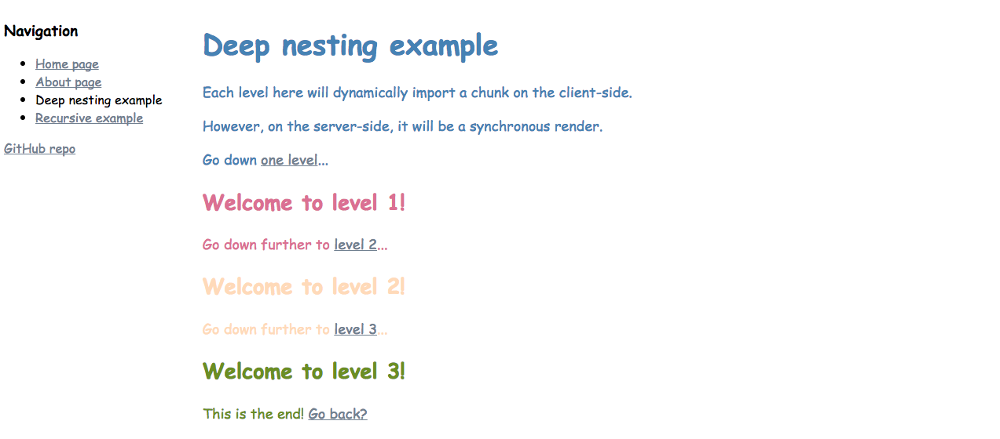

A really basic example of SSR with code-splitting using [react-universal-component](https://github.com/faceyspacey/react-universal-component).

This project was ejected from [create-react-app](https://github.com/facebookincubator/create-react-app) so I can modify the webpack config.

Don't use this setup in production! This is just a starting point for those interested.



## Getting started

Run build and server.

```
yarn
yarn build
node server
```

Now navigate to [http://localhost:3000](http://localhost:3000) and you should see the page render with only
`bootstrap` and `main` chunks.

If you go to [http://localhost:3000/home](http://localhost:3000/home), then you should see the page
server-side rendered, and served with the additionally matched chunk.
